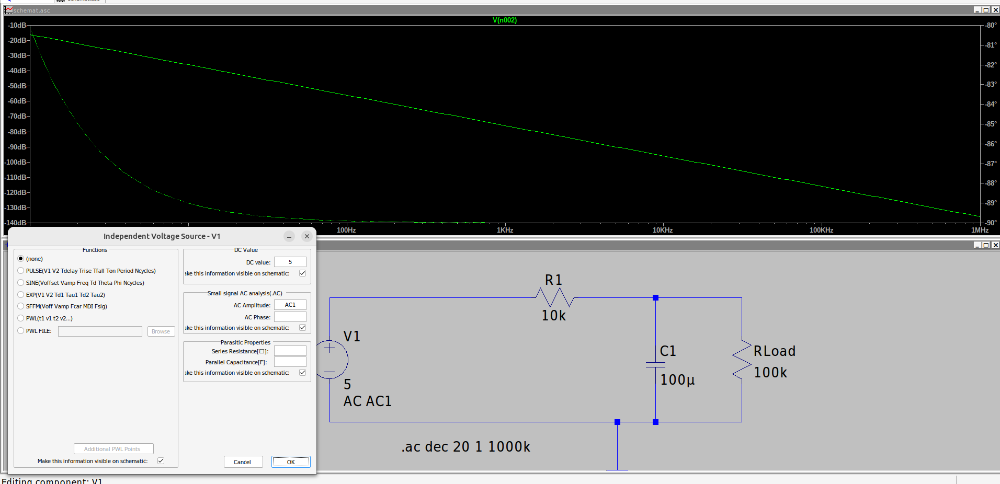
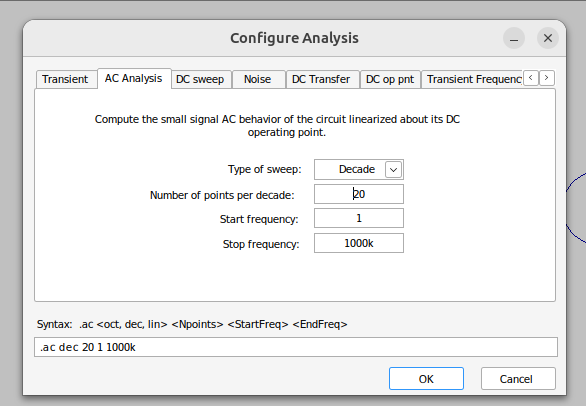

# Filtr RC

## Schemat

Źródło sygnału - Napięcie stałe 5V.  
**UWAGA** w parametrach dorzuciliśmy AC1.

## Symulacja - małosygnałowa AC

Wioski:
Kondensator ma "przerwę" dla DC i duzą oporność dla niskich częstotliwości.  
W związku z tym odkłada się większe napięcie dla niskich częstotliwości.

Jest to filtr dolnoprzepustowy - napięcie niskoczęstotlwościowe się odkłada na kondensatorze.

Next step:

- Dorzucić informację na temat fazy (być może typ symulacji transient).