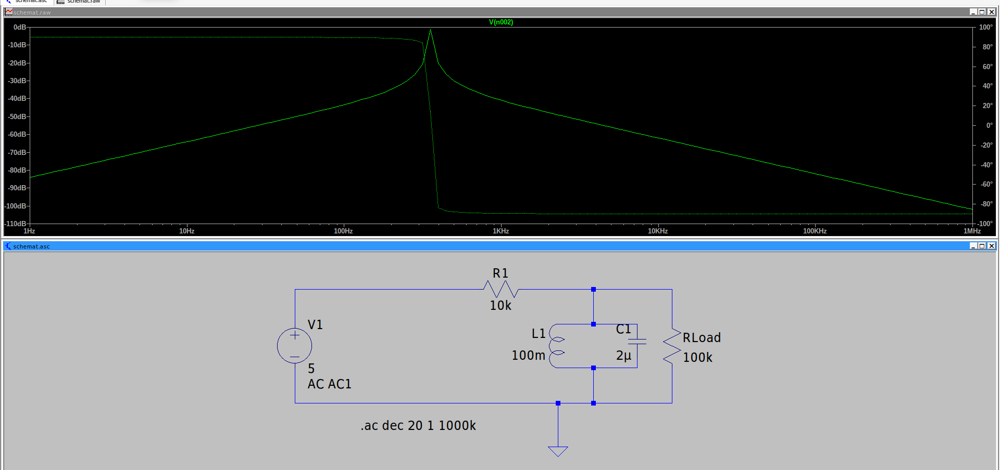

# Rezonans równoległy LC

## Schemat

Źródło sygnału - Napięcie stałe 5V.  
**UWAGA** w parametrach dorzuciliśmy AC1.

## Symulacja - małosygnałowa AC

Wnioski:

- przepuszcza konkretną częstotliwość f0 = 1/(2*pi*sqrt(LC)). W naszym przypadku L=100mH C=2uF, podstawiając do wzoru, 1/(2*pi*sqrt((100*10^-3)*(2*10^-6)))= 355,88 Hz