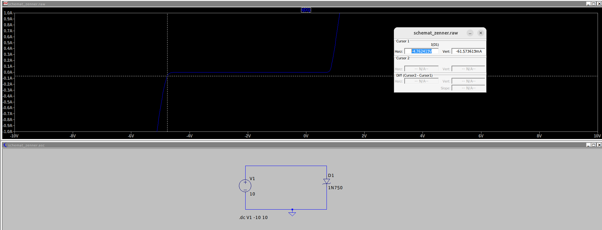

# Charakterystyka diody

**UWAGA** - aby wykres nie zawierał dużych prądów Teta Amperów - prawy przycisk myszy na wykresie, view -> manual limits

## Schemat - dioda idealna

## Schemat - dioda zennera

## Symulacja - małosygnałowa AC

Wnioski:

- dioda zaczyna przewodzić od ~0.6-0.8V

**UWAGA:** Dioda 1N4148 mimo że ma zadeklarowane napięcie przebicia, wcale go nie ma w symulacji.
Diody zenera natomiast mają.

