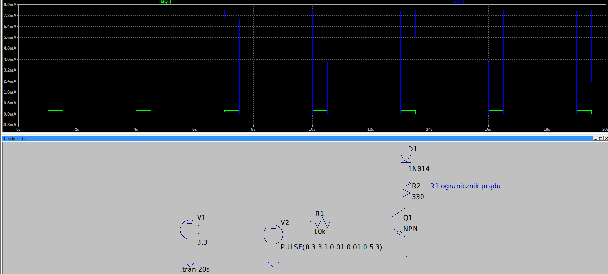
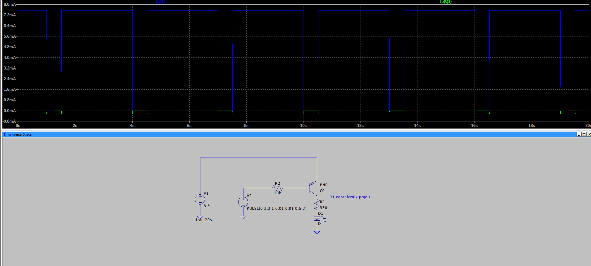
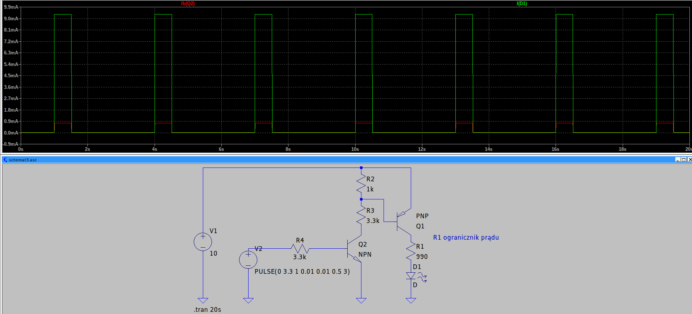

# Tranzystor jako przełącznik

## Wariant 1. Podstawowy

Schemat typowego przełącznika - dioda między +3.3V a tranzystorem.
R2 ogranicza prąd. Na schemacie pokazany prąd bazy i prąd kolektora

Prąd bazy 240 uA
Prąd kolektora prawie 8mA.

Układ działa bez zastrzeżeń.

# Wariant 2. Podłączenie odbiornika do masy (rezystor tym razem)

Tym razem inny tranzystor. PNP - w przypadku gdy V2 = 0, zaczyna płynąć prąd bazy (popatrz na to jakby tranzystor był diodą). Z V1 do V2 zaczyna płynąć prąd.
Czyli gdy V2 = 0 to płynie prąd bazy i płynie prąd kolektora (świeci dioda).
Gdy V2 = 3.3V nie płynie prąd bazy i nie płynie prąd kolektora (dioda nie świeci)
Przełącznik działa jakby "odwrotnie" w stosunku do poprzendiego.
Zwróć uwagę na prąd bazy - zielony - na rysunku jest ujemny (czyli mały odcinek czasu jest zerowy)

# Wariant 3. Podłączenie odbiornika do masy (rezystor tym razem) z usprawnieniem

Dorzuciliśmy jeszcze jeden tranzystor aby odwrócić polaryzację - czyli teraz będzie się układ 
zachowywał jak z wariantu 1. Q2 działa jak wspólny emiter - odwraca fazę.

Czerwony - prąd bazy Q2
Zielony - prąd kolektora Q1