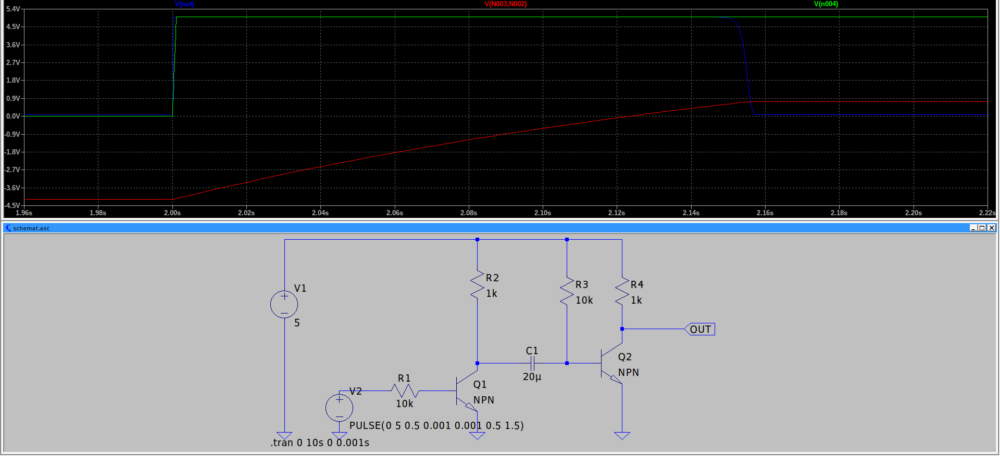
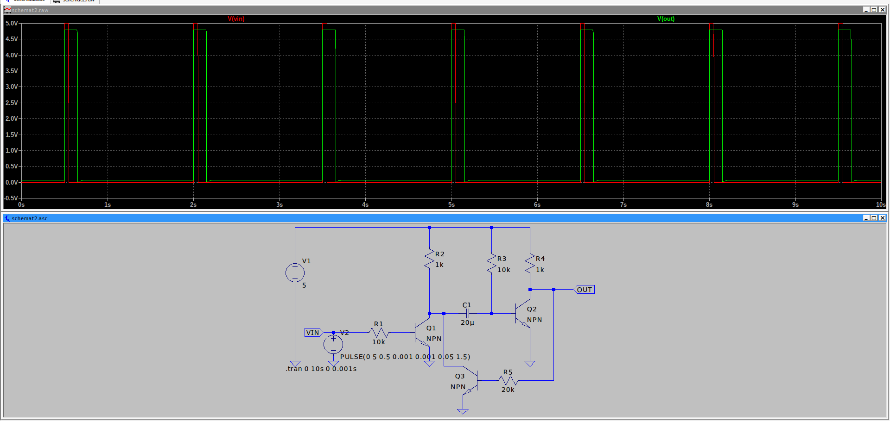
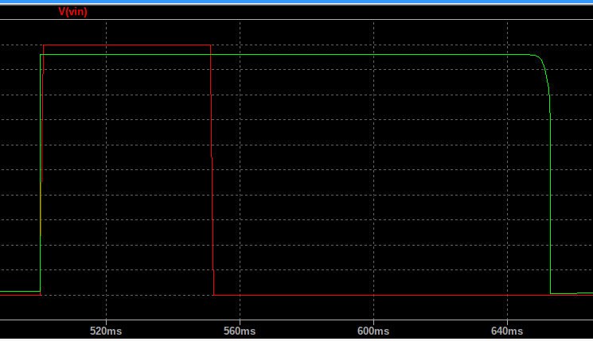
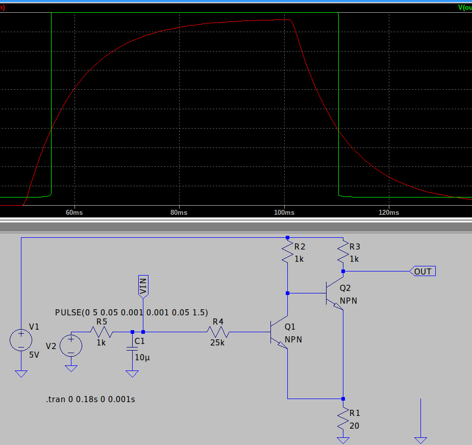
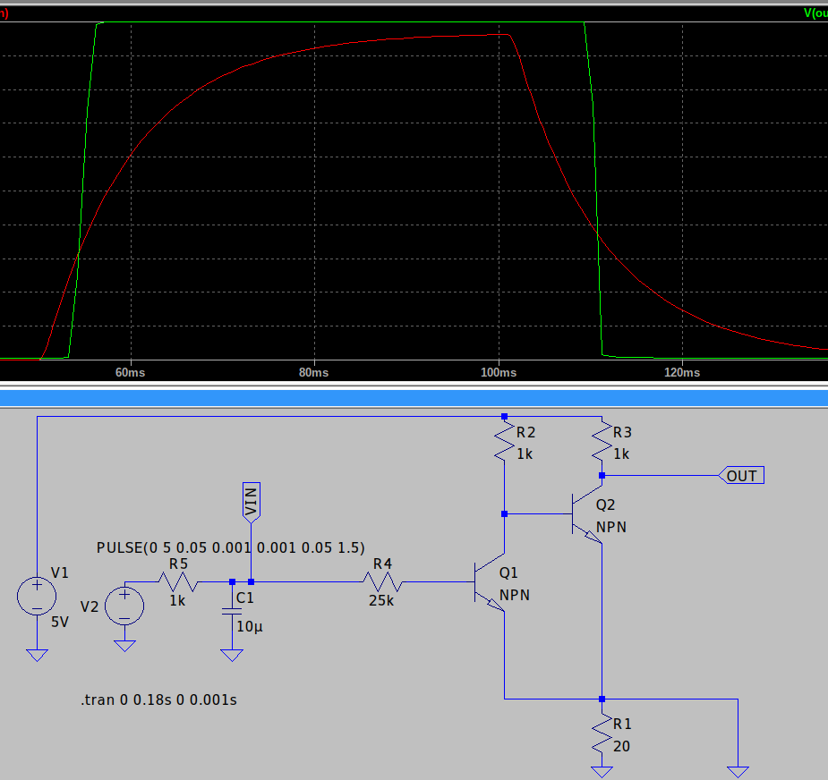

# Tranzystor jako generator impulsów

## Wariant 1. Podstawowy

kolor zielony - napięcie na V2
kolor niebieski - napięcie na wyjściu
kolor czerwony - napięcie na kondensatorze

Wnioski:

- układ ma stromą charakterystykę przy początku impulsu, niestety koniec impulsu jest niestety niezbyt stromy  
- w zależności od pojemności kondensatora regulujemy długość impulsu  
- napięcie na kondensatorze jest o 0,6 większe - dodatkowy spadek napięcia na Baza-Emiter Q2  
- kondensator ładuje się tylko gdy płynie prąd w V2 więc **jeśli sygnał wyzwalający jest krótszy, krótszy jest też impuls**

## Wariant 2. Kopniak z wyjścia.

Dorzucamy tranzystor ze "sprzężeniem zwrotnym" który zniweluje ostatnią dolegliwość wariantu 1 - krótki impuls na wejściu nie będzie powodował krótszego impulsu na wyjściu - kondensator naładuje się do końca

Nadal zbocze opadające nie jest tak strome.

## Wariant 3 (nie do konca wariant) histereza

Tutaj nie ma tak naprawde generatora impulsów lecz tylko pokazane działanie przerzutnika Schmitta

Jak widać zbocze opadające jest "strome" - wszystko za sprawą rezystora R1 i spadku na nim. Powstaje tam histereza - różny spadek napięcia w zależności który tranzystor przewodzi. Przez różny spadek napięcia na R1 są różne wartości progowe przewodzenia tranzystorów które rzutują na różne wartości sygnału wejściowego powodujące przerzucenie.  
** Dodać opis **

Jakby nie było tego rezystora R1 (albo, tak jak na schemacie byłby zwarty do masy):

Ani jedno zbocze nie jest strome.