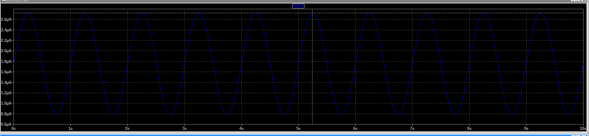

# Wtórnik emiterowy

## Schemat 1

Prad bazy:

Prąd emitera

### Wnioski:
- Wtórnik emiterowy, napięcie na wyjściu - zielone, jest mniejsze w stosunku do napięcia wejściowego (niebieskie) o 0,74V (spadek napięcia na diodzie). 
- Napięcie wyjściowe jest w "fazie" w stosunku do napięcia wejściowego. 
- Sinusoida ma offset 2.5V - żeby zniwelować wartość progową 0.74V dla diody (inaczej mielibyśmy obcięte dolne połówki sinusoidy).
- Stosunkowo mały prąd bazy (ok 2 uA) w stosunku do prądu kolektora (czy emitera+bazy)

## Schemat 2 Niskoprądowy klucz

Dorzucając wtórnik emiterowy możemy kluczować "słabym" sygnałem wejściowym - pobiera niski prąd

## Schemat 3 Emiterowy stabilizator napięcia

mały prąd bazy, duży prąd emitera

## Schemat 4 Kompensacja

Normalnie wtórnik emiterowy obniża napięcie wyjściowe o spadek na diodzie. Da się temu zaradzić.
Wrzucamy tranzystor PNP który ma spadek napięcia  w kierunku "wyżej" i kompensujemy spadek napięcia w kierunku niżej dla tranzystora NPN. Wykres przedstawia sinusodidę wcześniej i później