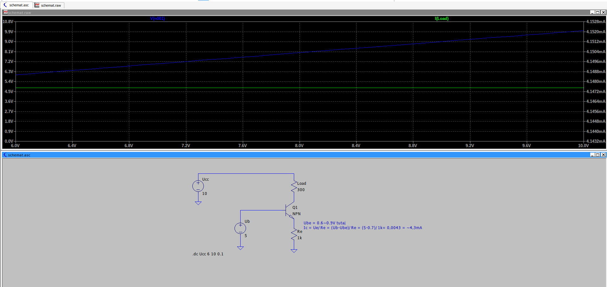
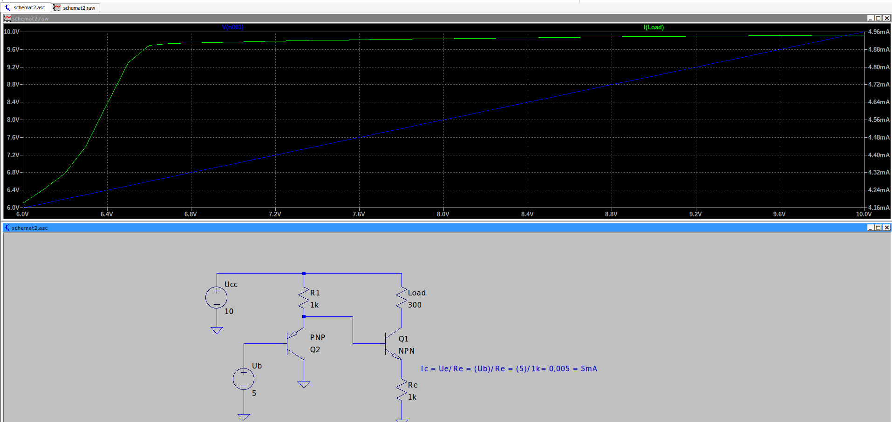

# Źródło prądowoe

## Schemat 1

Wzór na prąd Ic ~ (Ub-0.6)/Re
Niebieski kolor - napięcie Ucc - sweep z 6V do 10
Zielony kolor - prąd
Stworzylem idelane zrodlo prądowe
Napięcie bazy można zrobić ze sztywnego dzielnika - np dwóch rezystorów, albo
rezystra i diody zennera.
Albo z kilku diód.

## Sprobujmy wyrzucić 0.6 z równania poprzez kompensację spadku napięcia

## Schemat 2

Tak w rzeczywistości jest - mamy wyeliminowany spadek napięcia.
Uwaga: te tranzystory pracują w innych konfiguracjach (wtórnik + źródło (wspólny emiter))
inaczej wyglądają spadki i wartości temperatur. 
Kompensacja nieidealna.