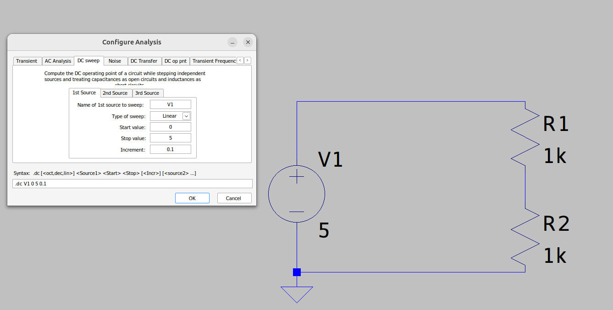
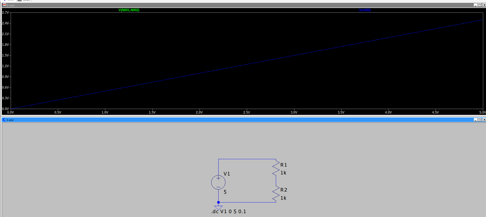
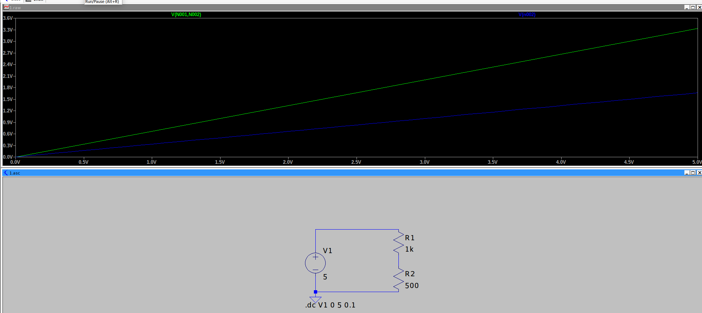
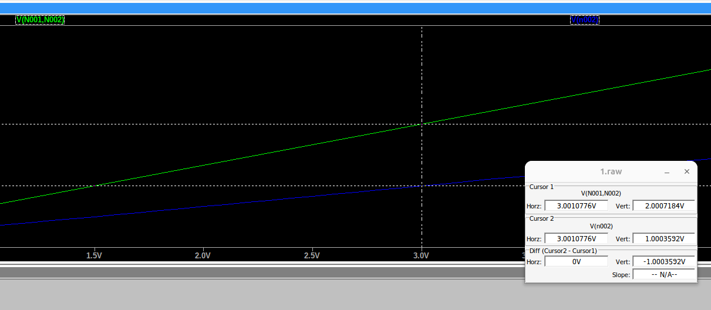

# Dzielnik napięcia

To mój pierwszy dokument na temat symulacji LTSpice. Postanowiłem go napisać by zostawić jakiś ślad (może przyda mi się w przyszłości do przypomnienia wiedzy) i byćmoże komuś pomóc w dalszej nauce.

## Sprawdzanie spadku napięcia na danym elemencie.
Najechanie na lewo (jedną stronę elementu) i naciśnięcie przycisku ale nie puszczenie go (czerwona sonda). Następnie przejechanie z trzymanym przyciskiem na drugą końcówkę badanego elementu (czarna sonda).

## Schemat

Przedstawiłem prosty sposób symulacji.

## Wykresy dla R1=1k i R2=1k

Zielony to wykres spadku na R1, niebieski na R2
Jak widać są takie same - wniosek - takie same spadki napięcia.

## Wykresy dla R1=1k i R2=500

Zielony to wykres spadku na R1, niebieski na R2
Różnica spadków napięcia widoczna

Poprzez zabawę z kursorami (prawy przycisk place cursor) oraz przełączanie między wykresami (górna część
wykresu na której znajdują się V(N001,N002) lub V(n002) można się przełączać kilkając na nie zostało zmierzone napięcie na R1 i R2 dla przykładowej wartości 3V

Dla R1 wynosi 2V, dla R2 wynosi 1V.
Suma spadków napięć na odbiornikach (R1,R2) daje nam napięcie zasilające.