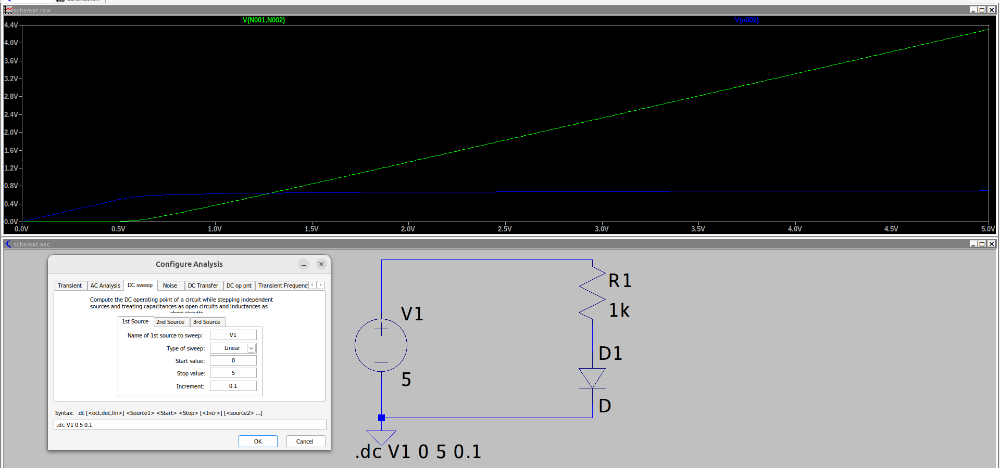

# Dzielnik z diodą

## Schemat

Przerobiony dzielnik napięcia z poprzedniego przykładu.
Komentarz:

- kolor niebieski - dioda, kierunek przewodzenia
- kolor zielony - rezystor

analiza DC sweep liniowa

prąd zaczyna płynąć gdy dioda zaczyna przewodzić - okolice 0.5V na rysunku
taki sam spadek napięcia utrzymuje się cały czas na diodzie.

Dioda w kierunku zaporowym nie przewodzi (poniżej napięcia przebicia)