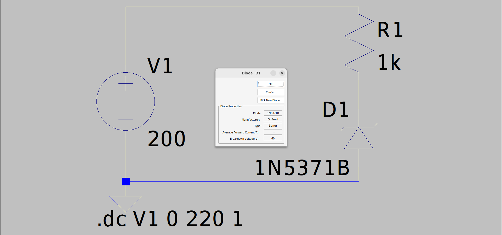
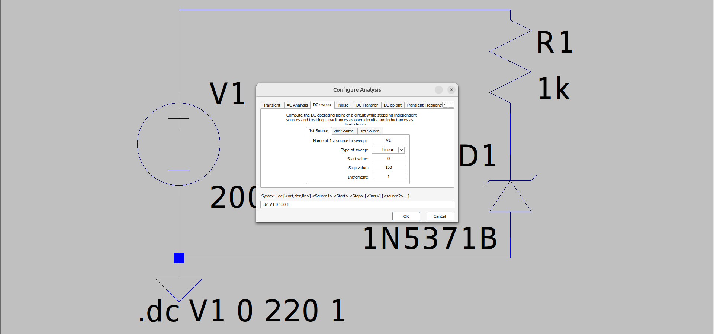
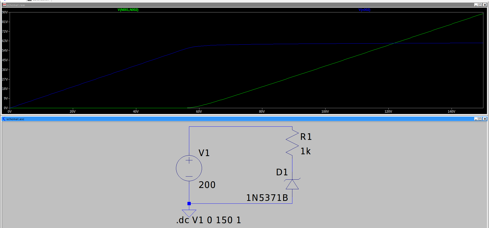

# Dioda zaporowo

## Schemat

Wybrałem konkretny model diody z zaporowym napięciem 60V.
Symulacja:
Zmieniamy parametry DC sweep
 
Wynik
 

Komentarz:
Nic się nie dzieje do 60V, następnie dioda zaczyna przewodzić.

Na rezystorze dla np 80V spadek napięcia wynosi 20V. Prąd płynący przez rezystor (kliknąć na rezystor) wynosi 20.003342mA.  Obliczmy oporność R = 20 / 0.02 = 1k