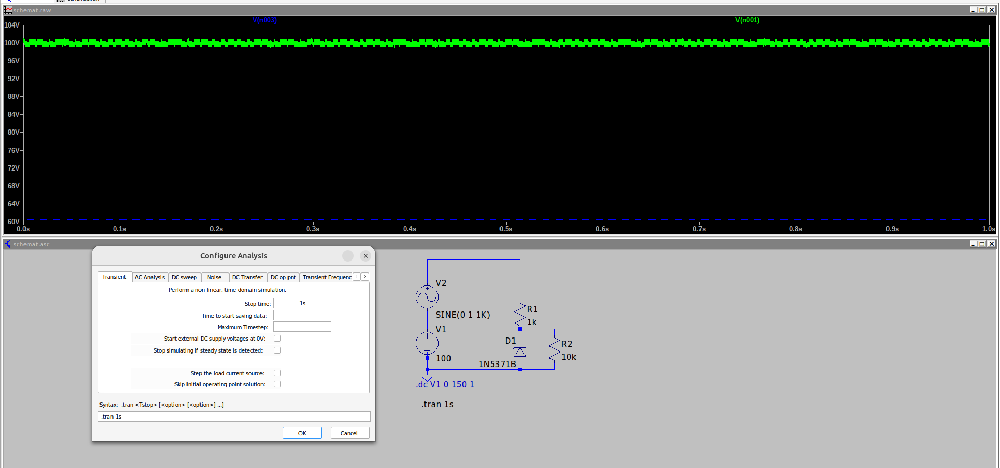
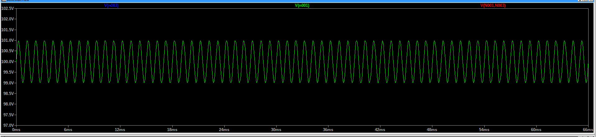
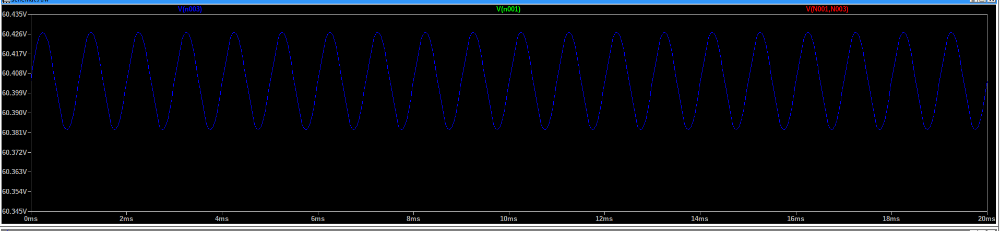

# Stabilizator

## Schemat

Jako źródło szumu - sinusoida

## Symulacja - tym razem czasowa

Ta sama dioda co wcześniej.

- Zielony kolor - napięcie zasilające "zaszumione"
- niebieski kolor - na dole, napięcie stabilizowane.

Napięcie zasilające +1 -1V sinus dorzucony na stałe napięcie

Napięcie stabilizowane pływa około 0.1V