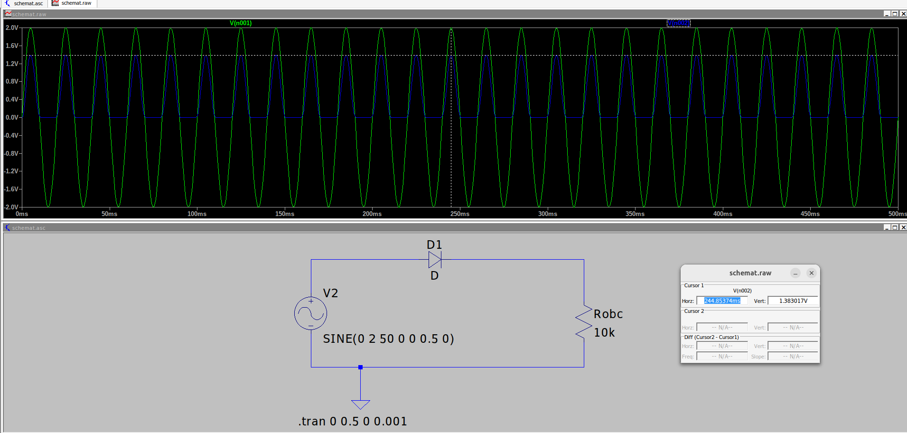

# Prostownik jednopołówkowy

## Schemat

Źródło sygnału - sinus 50 Hz 1V

## Symulacja - czasowa

Zielony - źródło
Niebieski - napięcie na odbiorniku

Komentarz:
Napięcie nadal "pulsuje" - spadek 0.6V na diodzie