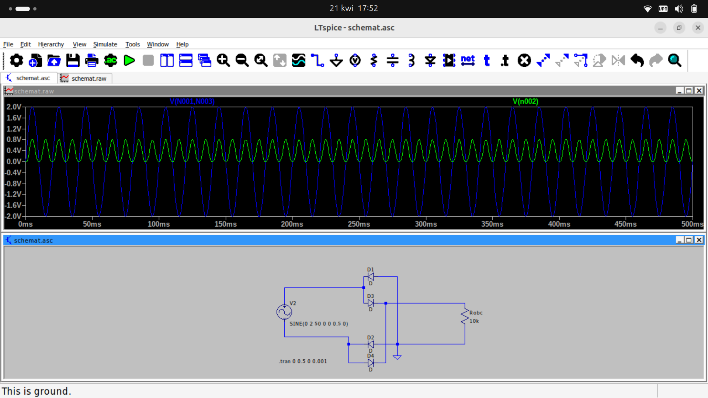

# Prostownik dwupołówkowy

## Schemat

Źródło sygnału - sinus 50 Hz 1V
Uwaga: GND zmienione

## Symulacja - czasowa

Niebieski - źródło (mierzone miedzy + i - źródła)
Zielony - spadek napięcia na odbiorniku

Komentarz:
Prostownik prostuje, prąd płynie w jedną stronę. Napięcie jest niższe o dwa spadki na diodach (na diodzie "wejsciowej" i wyjściowej" przez którą płynie aktualnie prąd.

Next step:
Dorzucić filtrację.